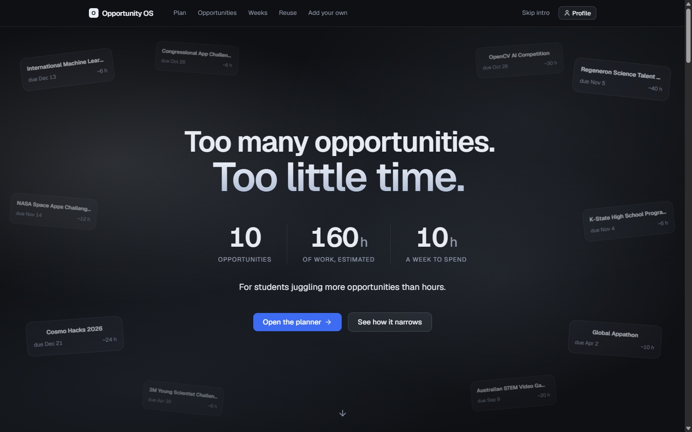
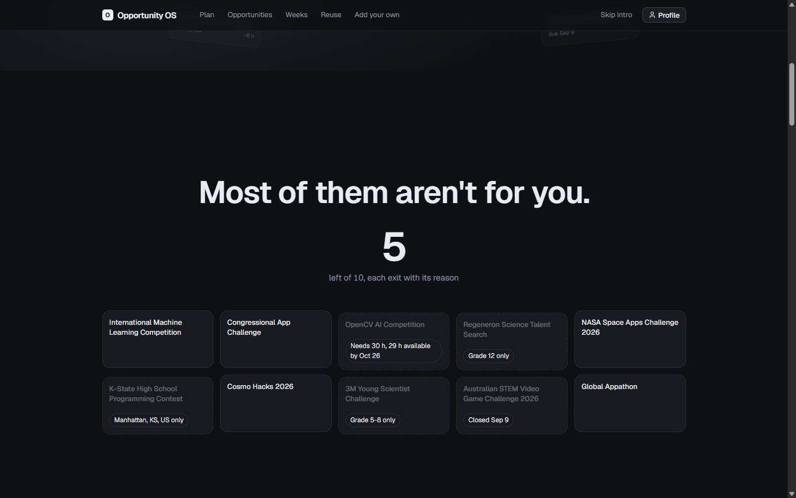
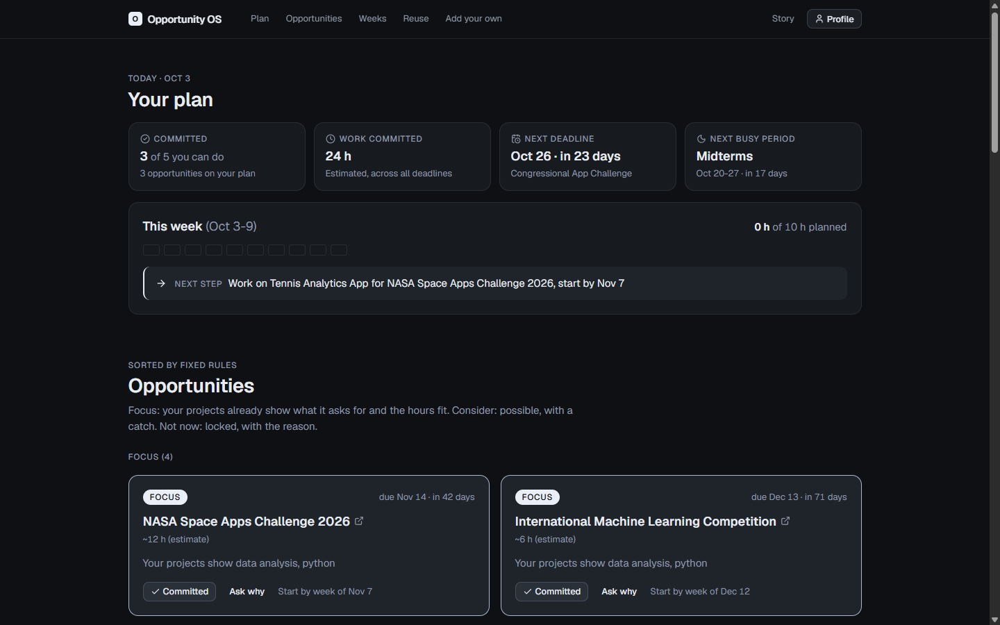
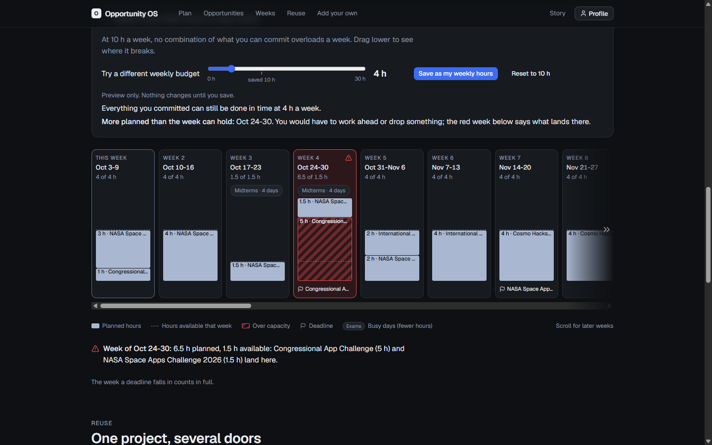
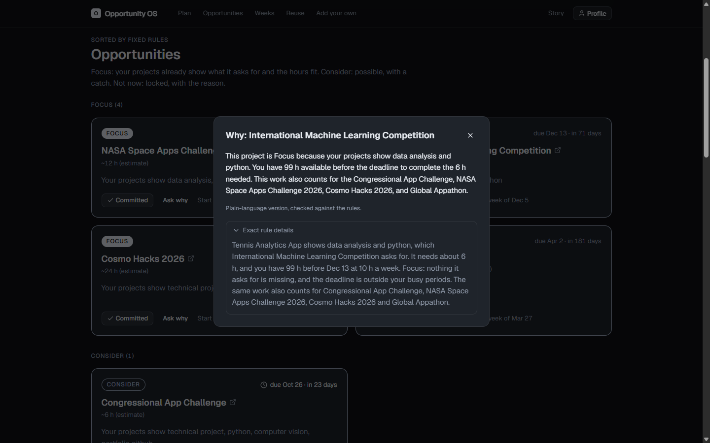

# Opportunity OS

**Live demo: https://opportunity-os-pink.vercel.app** (best on desktop; hosted Ask why uses cached or template answers, live Gemma via Gemini API runs locally)

### Too many opportunities. Too little time.

**A planner that tells students which opportunities are worth their limited hours, and exactly why.**



> **10** opportunities on the list · **160 h** of estimated work · **10 h** a week to spend.
> That's about 16 weeks of work for one week's worth of time. Opportunity OS answers the question every ambitious student faces: **which ones, and when?**

---

## The problem

High-school students are flooded with competitions, hackathons, science fairs and programs. Every one looks like a door worth opening. But:

- **Most aren't actually open to you.** Wrong grade, wrong region, deadline already passed, or a requirement you can't show yet. You find out after hours of reading.
- **Deadlines collide with real life.** Midterms don't move for the App Challenge.
- **Nobody tells you why.** Recommendation tools hand you a match score and no reasoning, so you can't trust them or argue with them.
- **The same work could count twice.** One good project can qualify you for several opportunities, but nothing shows you that.

The result: students either over-commit and burn out, or freeze and apply to nothing.

## My solution

Opportunity OS turns a pile of opportunities into a plan you can trust:

1. **It cuts the list, with a reason for every cut.** Each opportunity lands in **Focus**, **Consider** or **Not now**. Locked ones say exactly why: *"Grade 12 only"*, *"Closed Sep 9"*, *"Manhattan, KS, US only"*, *"Needs 30 h, 29 h available by Oct 26"*.
2. **It plans your weeks backward from each deadline.** Commit to what fits and see when to start. Exam weeks get fewer hours. A week with more planned than it can hold turns red, with a sentence naming what lands there.
3. **It finds work you can reuse.** One project, several doors: a thread diagram shows which of your projects qualifies you for which opportunities.
4. **It explains itself in plain language.** *Ask why* on any card gives the reasoning. Rules decide; AI only rephrases, under a strict fact check.



---

## Try it in 2 minutes

Open **https://opportunity-os-pink.vercel.app** on a laptop or desktop.

1. **Watch the first screen.** The pile of 10 opportunities, the 160 h vs 10 h problem. Scroll: half of them drop out, each with its reason.
2. **Open the planner.** A demo student profile is preloaded (grade 10, one computer-vision project, Midterms Oct 20-27, 10 h a week).
3. **Commit** to *International Machine Learning Competition* and *Congressional App Challenge*. See the weeks fill in and "start by" dates appear.
4. **Ask why** on the App Challenge. It's *Consider*, not *Focus*, because it's due during Midterms.
5. **Drag "What if" to 4 h a week.** A week turns red and the app names exactly what overflows. Nothing is saved until you press Save.
6. **Add your own** opportunity in the form at the bottom. The same rules check it and show a registration checklist.

Add `?mode=tool` to the URL to skip the intro and open the planner directly.



---

## Why it stands out

| Criterion | What I built |
|---|---|
| **Technical execution** | A deterministic rules engine and a backward-filling scheduler as pure TypeScript functions, with automated tests, including property tests: hours are always conserved, nothing is scheduled before today or after a deadline, order never matters, and more capacity never creates more overload. |
| **Innovation** | **Rules decide, AI only explains.** No black-box matching. The AI rephrases one card's facts, and a checker rejects any sentence that invents a title, a number, or a "score". |
| **Impact** | Built for the real student problem of too many options and not enough hours. It answers *which* and *when*, not just *what*. Every decision comes with a reason a student, parent or counsellor can check. |
| **Completeness** | Works end to end in the browser, with no account and no backend. If the AI is unavailable, it falls back to saved answers, then to the rule text, so the demo never depends on it. |
| **Design & UX** | Calm dark interface; one accent colour; red reserved for overloaded weeks. Keyboard accessible, screen-reader text for the diagram, and full reduced-motion support. |



---

## How it works

**Rules, not scores.** There are no percentages or match meters anywhere, just facts you can check.

- **Eligibility** (pass/fail): grade range, deadline not passed, location, prerequisites.
- **Evidence over claims:** a skill only counts if one of your *projects* shows it, not because you ticked a box.
- **Matching:** tag-based only, using a fixed vocabulary (python, data analysis, technical project, ...). No fuzzy or AI matching.
- **Runway:** if an opportunity needs more hours than you have before its deadline, even as your only commitment, it's *Not now*.
- **Focus vs Consider:** Focus means your project matches, the deadline isn't in a busy week, and either nothing is missing or the same project also counts elsewhere.
- **Scheduler:** fills each deadline's week first, then earlier weeks, and flags any week over capacity, naming the cause.

**AI with guardrails.** *Ask why* gives a model only the structured facts for one card. Before any sentence is shown, a pure checker rejects it if it:

- names an opportunity that isn't in the list,
- uses a number that isn't in the facts it was given (written as digits *or* words),
- mentions scores, percentages or match meters, or leaks raw field names.

The chain is: live answer (8 s limit) → saved answer → rule text. On the hosted site there is no live call: Ask why shows a saved answer when one matches, otherwise the rule text. The rule text is always one click away under *Exact rule details*.



---

## The hackathon story

**Inspiration.** I'm a competitive student juggling school with hackathons, science fairs, competitions, and clubs like Speech and Debate. Every season I had a list of twenty "great opportunities" and nowhere near enough hours. The one trick that worked was building a single solid project and submitting it to several contests, but deciding which ones were worth it, and which of my existing work counted for each, was all gut feeling and messy spreadsheets. Existing tools either just list opportunities or rank them with a number nobody can explain. I wanted something that makes those calls with me and shows its reasoning.

**How I built it.** I wrote the rules down *before* the code, so every behaviour has a written rule and a test. Engine first (eligibility, matching, tiers, reuse), then the week scheduler, then the interface, with AI as the final layer. The rules make each decision, and AI turns those decisions into plain-language explanations. I built the interface with Claude Code and used Gemma through the Gemini API for the "Ask why" panel. The ten opportunities were hand-checked against each organiser's own page; the verbatim quotes are in `.research/`.

**Challenges I ran into.**
- **Honest drama.** On real data at 10 h a week, no combination of opportunities overloads a week. Instead of fudging the data to get a red week for the demo, I built a *what-if* slider and say so on screen: *"At 10 h a week, no combination of what you can commit overloads a week. Drag lower to see where it breaks."*
- **Tuning the AI for clear answers.** Early on, the model spent its whole output budget reasoning and never reached the answer. Setting a strict timeout and minimal thinking fixed that, and the panel now always lands on a clear explanation.
- **Making AI explanations trustworthy.** A fact checker compares every title and number in an AI answer against the engine's facts. It caught small slips like numbers written as words and internal field names, and now blocks both. The explanations stay accurate, and the app works even when the AI is offline.

**Accomplishments I'm proud of.** A scheduler with property-based tests. Zero scores anywhere in the product. A design where AI and rules each do what they're best at, and a demo that doesn't depend on the AI being up.

**What I learned.** Explaining a decision is harder, and more valuable, than making one. And pairing deterministic rules with AI explanations gives you something people can actually trust: the rules supply the reliability, and the AI supplies the clarity.

**What's next.** The goal is for Opportunity OS to live up to the "OS" in its name: an operating system for your time, built on one idea, that your existing work showing real depth is your most reusable resource. It should help anyone, not just students, manage limited hours by reusing what they've already built. AI is a big part of how it gets there.
- **Agentic AI for opportunity discovery.** Agents will find opportunities, read each organiser's own page, and extract deadlines and eligibility, so nobody has to add them by hand. Every extracted field would carry a verbatim quote from the source, and uncertain ones get flagged for review.
- **Agents that keep your plan current.** They re-check sources so deadlines and closures update on their own, and they can nudge you when a start-by date arrives.
- **Agents that suggest what to build next.** They spot the one piece of work that would unlock the most opportunities.
- **A living profile.** Projects, writing, and achievements accumulate as assets, with a record of what each can support.
- **Beyond students.** College fellowships and research, then jobs, certifications, and career transitions.
- **Calendar export** of your weekly plan.
- **Mobile layout.**

---

## Honest limits

- **Rule-based.** It applies fixed rules; it doesn't learn or predict at this stage.
- **Tag-based matching.** A project counts only through the tags you give it.
- **A curated 10-entry dataset**, hand-checked rather than live.
- **Estimates are estimates.** Effort hours are rough, and the week a deadline falls in counts in full.
- **Location is an exact match** with your profile region, unless the opportunity is online.
- **Your data stays in this browser.** Your profile, commitments and added opportunities are kept in this browser's local storage only; nothing syncs between devices.
- **Desktop layout only.**

## Built with

Vite · React 19 · TypeScript · Tailwind CSS v4 · shadcn/ui (Base UI) · lucide icons · Geist · Vitest · Gemma via the Gemini API (Ask why).

```
src/engine/      rules: eligibility, matching, tiers, reuse, gaps, weeks, scheduler (pure, tested)
src/lib/         view models, Ask why prompt + fact check, AI fallback chain, add-your-own draft (pure, tested)
src/components/  React UI that only displays what the pure modules compute
src/data/        the 10 hand-checked opportunities (+ saved AI answers)
.research/       sources and verbatim quotes for every opportunity
```

## Run locally (optional)

Requirements: Node 20.19+ or 22.12+ and npm.

```bash
npm install
npm run dev        # http://localhost:5173
npx vitest run     # tests
```

For live Ask why answers, create `.env.local` (gitignored) with `GEMINI_API_KEY` and `GEMINI_MODEL`. The Vite dev server proxies `/api/llm/generate` and adds the key server-side, so it never reaches the browser.

## License

[MIT](LICENSE) © 2026 Rudra
